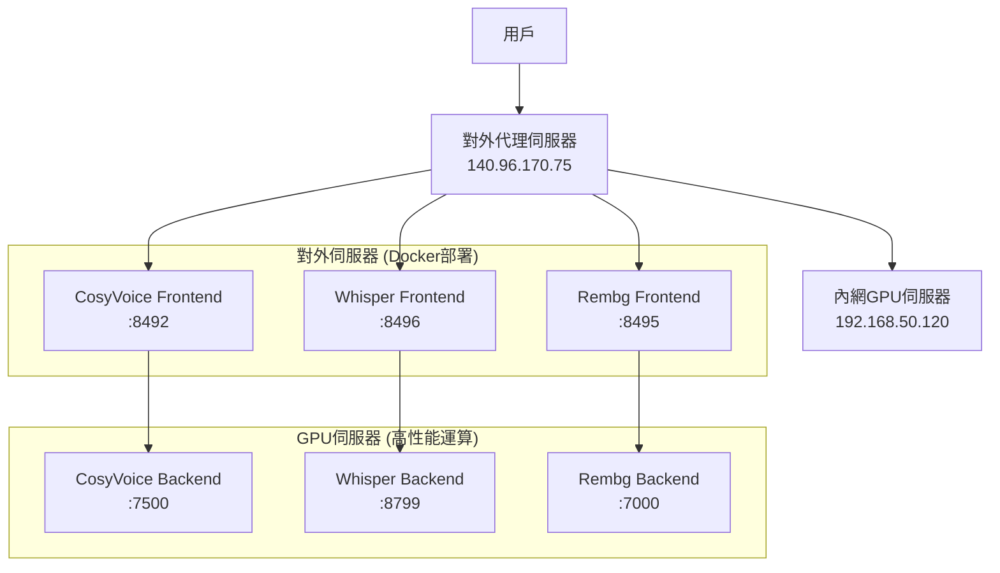

# AI Services Suite 🤖

一個基於分散式架構的AI服務套件，提供語音合成、語音轉文字和圖片去背三大核心功能。採用前後端分離設計，將計算密集型任務部署在內網GPU伺服器上，通過對外代理伺服器提供服務。

## 🌟 核心服務

### 🎤 CosyVoice 語音複製系統
基於 CosyVoice2 的高品質語音克隆和語音合成系統
- **功能**: 語音特徵提取、語音合成、音色保存載入
- **端口**: 前端 8492, 後端 7500
- **特色**: 支援多語言、高保真語音克隆、Web界面操作

### 🎧 Whisper 語音轉文字系統  
基於 OpenAI Whisper 的多格式語音轉文字系統
- **功能**: 音頻/視頻轉文字、時間軸標記、繁體中文輸出
- **端口**: 前端 8496, 後端 8799
- **特色**: 支援多種格式、自動簡繁轉換、隊列處理

### 🖼️ Rembg 圖片去背系統
基於 BiRefNet 的智慧圖片背景去除系統
- **功能**: 自動圖片去背、批次處理、API調用
- **端口**: 前端 8495, 後端 7000
- **特色**: 高精度去背、快速處理、RESTful API

## 🏗️ 系統架構



### 架構優勢

- 🔒 **安全性**: GPU伺服器位於內網，不直接暴露
- ⚡ **性能**: 專用GPU伺服器處理AI運算
- 🌐 **可擴展**: 前端可水平擴展，後端可集群部署
- 🐳 **容器化**: 前端服務Docker化，便於部署管理
- 🔄 **負載均衡**: 支援多個後端伺服器負載分散

## 🚀 快速開始

### 環境要求

#### GPU伺服器 (後端)
```bash
# 硬體要求
- NVIDIA GPU (建議 RTX 4070 Ti 或以上)
- 記憶體: 16GB+
- 儲存: 100GB+

# 軟體環境
- Python 3.8+
- CUDA 11.8+
- PyTorch 2.0+
- FFmpeg
```

#### 代理伺服器 (前端)
```bash
# 硬體要求 
- 基本CPU即可
- 記憶體: 4GB+
- 儲存: 10GB+

# 軟體環境
- Docker & Docker Compose
- 或 Python 3.8+
```

### 安裝部署

#### 1. 後端服務器部署

```bash
# CosyVoice 後端
cd cosy_fullend/cosyvoice_backend
pip install -r requirements_api.txt
python voice_cloning_api.py

# Whisper 後端  
cd Whisper_fullend/whisper_backend
pip install torch torchvision torchaudio openai-whisper flask waitress opencc-python-reimplemented
python waitress_server.py

# Rembg 後端
cd rembg_fullend/rembg_backend  
pip install flask rembg waitress pillow requests
python server_waitress.py
```

#### 2. 前端服務器部署

```bash
# 批次啟動所有前端服務
cd cosy_fullend/cosyvoice_frontend && docker-compose up -d
cd Whisper_fullend/Whisper_frontend && docker-compose up -d  
cd rembg_fullend/rembg_frontend && docker-compose up -d
```

## 📚 API 使用指南

### CosyVoice API

```python
import requests

# 提取語音特徵
files = {'audio_file': open('sample.wav', 'rb')}
data = {'voice_name': 'my_voice', 'reference_text': '參考文字'}
response = requests.post('http://IP:8492/extract_voice', files=files, data=data)

# 生成語音
data = {'text': '要合成的文字', 'voice_name': 'my_voice', 'language': 'zh'}
response = requests.post('http://IP:8492/generate_voice', json=data)
```

### Whisper API

```python
import requests

# 語音轉文字
with open("audio.mp3", "rb") as f:
    files = {"file": f}
    data = {"model": "large-v3", "timestamps": "true"}
    response = requests.post('http://IP:8496/transcribe/file', files=files, data=data)
    
result = response.json()
print(f"轉錄結果: {result['text']}")
```

### Rembg API

```python
import requests

# 圖片去背
response = requests.post(
    'http://IP:8495/api/remove',
    json={"url": "https://example.com/image.jpg"}
)

# 保存結果
with open("removed_bg.png", "wb") as f:
    f.write(response.content)
```

## 🌐 服務端點

| 服務 | 前端端點 | 功能 |
|------|---------|------|
| CosyVoice | `:8492` | 語音複製和合成 |
| Whisper | `:8496` | 語音轉文字 |
| Rembg | `:8495` | 圖片去背 |

## 🛠️ 故障排除

### 常見問題

#### 連接問題
```bash
# 檢查網絡連通性
ping 192.168.50.120

# 檢查服務狀態
curl http://192.168.50.120:7500/  # CosyVoice
curl http://192.168.50.120:8799/health  # Whisper  
curl http://192.168.50.120:7000/  # Rembg
```


## 📊 性能指標

| 服務 | 平均處理時間 | GPU使用率 | 記憶體需求 |
|------|-------------|-----------|-----------|
| CosyVoice | ~3-5秒 (10秒音頻) | 60-80% | 6-8GB |
| Whisper | ~0.3-1秒 (每秒音頻) | 40-60% | 2-4GB |
| Rembg | ~1-3秒 (1080p圖片) | 30-50% | 2-3GB |


## 📈 使用統計

- 🎤 **CosyVoice**: 支援中英雙語，音質保真度 >95%
- 🎧 **Whisper**: 支援10+種音頻格式，識別準確率 >98%  
- 🖼️ **Rembg**: 支援JPG/PNG格式，去背精度 >96%


## 📄 授權

本項目基於 MIT 授權條款，並遵循以下開源組件的授權：

- [CosyVoice](https://github.com/FunAudioLLM/CosyVoice) - Apache 2.0
- [OpenAI Whisper](https://github.com/openai/whisper) - MIT
- [rembg](https://github.com/danielgatis/rembg) - MIT
- [Flask](https://flask.palletsprojects.com/) - BSD-3-Clause
- [Docker](https://www.docker.com/) - Apache 2.0


## ⭐ Star History

如果這個項目對您有幫助，請給我們一個 ⭐！

---

<div align="center">
  
  
  
  
</div>

*最後更新: 2025年* 
